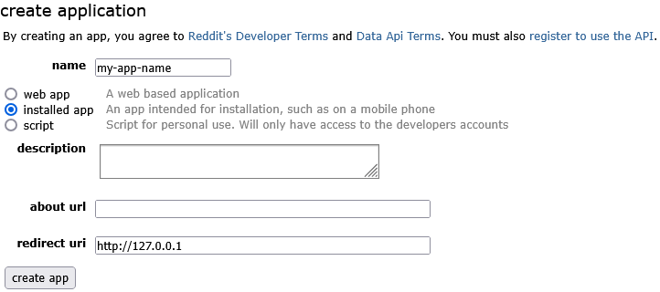

infinity-for-reddit
===================

This repository is an automatic builder for new releases of [Docile-Alligator/Infinity-For-Reddit](https://github.com/Docile-Alligator/Infinity-For-Reddit), that uses custom Reddit API key.

Setup
-----
In repository settings, check **Actions -> General -> Workflow permissions -> Read and write permissions**. Required for the Github Actions to be able to push new tags for releases.

In repository settings, add a repository secret named `REDDIT_API_KEY` under **Secrets and variables -> Actions**. Required to access the Reddit API in app.

Reddit API key can be obtained at https://old.reddit.com/prefs/apps/. Application must be created as follows:

Credits
-------
Authors of the original [Infinity APK Builder [Simple]](https://colab.research.google.com/drive/13AE8RvjnCfuBJGaACEqxeBIMo33_l-Sc) notebook.
