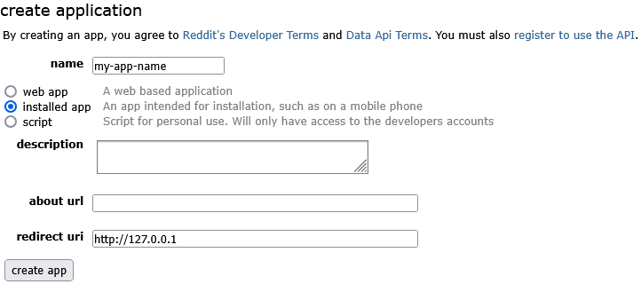

infinity-for-reddit
===================

This repository is an automatic builder for new releases of [Docile-Alligator/Infinity-For-Reddit](https://github.com/Docile-Alligator/Infinity-For-Reddit), that uses custom Reddit API key.

Setup
-----
In repository settings, check **Actions -> General -> Workflow permissions -> Read and write permissions**. Required for the Github Actions to be able to push new tags for releases.

In repository settings, add a repository secret named `REDDIT_API_CLIENT_ID` under **Secrets and variables -> Actions**. Required to access the Reddit API in app.

Reddit API key can be obtained at https://old.reddit.com/prefs/apps/. Application must be created as follows:

In repository settings, add a repository secret named `RELEASE_STORE_REPO_PAT` containing the GitHub PAT used to access the keystore repo.

In repository settings, add repository secrets named `RELEASE_STORE_PSWD`, `RELEASE_KEY_PSWD` which correspond to the passwords for the release signing keystore and key. Note that the key in the keystore is expected to have alias `dev.arisu.infinityforreddit` - as defined in [build workflow](.github/workflows/build.yml).

Credits
-------
Authors of the original [Infinity APK Builder [Simple]](https://colab.research.google.com/drive/13AE8RvjnCfuBJGaACEqxeBIMo33_l-Sc) notebook.
